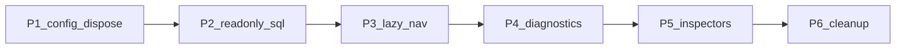

# План правок: от простого к сложному

Порядок выбран так, чтобы каждый этап давал пользу сам по себе и не требовал следующего. Не начинать миграцию инспекторов, пока жив `engine.dispose()` — иначе будет двойная работа.

---

## Этап 1. Конфиг и баг пула (просто, высокий эффект)

**1.1 Docker только на localhost**

- В [docker-compose.yml](docker-compose.yml): `"127.0.0.1:8502:8501"` вместо `"8502:8501"`.
- Согласовать [Dockerfile](Dockerfile) и [.streamlit/config.toml](.streamlit/config.toml): один источник правды для `address`/`headless`/`port`, чтобы том не перетирал образ.
- В [README.md](README.md) явно: доступ с LAN не предполагается.

**1.2 Убрать `engine.dispose()` у кэшированного движка**

`get_sqlalchemy_engine` в [src/core/db_utils.py](src/core/db_utils.py) — `@st.cache_resource`. Диспоз убивает общий пул.

Удалить все вызовы `engine.dispose()` / `raw_engine.dispose()` (около 20 мест): [data_loader.py](src/core/data_loader.py), [hosts_utils.py](src/hosts/hosts_utils.py), [audit_utils.py](src/audit/audit_utils.py), диагностики, modules storage/disks/tasks/networks, [certificates.py](src/cert/certificates.py).

В тестах (`test_hosts_utils.py`, `test_storage_utils.py`, `test_tasks_utils.py`) убрать `assert_called_once` на `dispose`.

Проверка: повторный rerun без пересоздания пула; смена БД в сайдбаре по-прежнему работает за счёт ключа кэша `db_name`.

---

## Этап 2. Реально read-only (просто-средне)

**2.1 Сессия PostgreSQL**

В `create_engine` / `connect_args` (или `execution_options` на connect): `default_transaction_read_only=on` либо `SET SESSION CHARACTERISTICS AS TRANSACTION READ ONLY` на каждом connect. Единая точка — [db_utils.py](src/core/db_utils.py), чтобы покрыть и SQLAlchemy, и будущие инспекторы.

Сырой `psycopg2.connect` в инспекторах пока не покрыт — либо тоже выставлять `options='-c default_transaction_read_only=on'`, либо отложить до этапа 5.

**2.2 SQL-редактор**

В [src/core/sql_editor.py](src/core/sql_editor.py):

- Отклонять не-SELECT (и CTE/`WITH` только если дальше SELECT): простой парсер первого слова / запрет `;` с несколькими стейтментами.
- Применять `MAX_ROW_LIMIT` (сейчас импортирован и не используется).
- Показывать ошибку read-only от PG, если кто-то обошёл фильтр.

**2.3 README**

Синхронизировать раздел «Безопасность»: read-only на сессии, а не «изменение невозможно через интерфейс» в вакууме.

---

## Этап 3. Рендер только активного раздела (средне, главный выигрыш по скорости)

Сейчас [src/app.py](src/app.py) в цикле по `st.tabs` вызывает все `render_*`. У Streamlit тело всех вкладок выполняется на каждом rerun.

Не оставлять `st.tabs` как маршрутизатор.

**Рекомендуемый минимум (без дробления на файлы страниц):** в сайдбаре или сверху `st.segmented_control` / `st.radio` со списком разделов; `if/elif` рендерит **один** module + diagnostics. Глобальный SQL-редактор — expander, свёрнутый по умолчанию, чтобы не занимать место.

**Следующий шаг того же этапа (если понадобится):** `st.navigation` + `st.Page` по skill Streamlit — вынести разделы в `app_pages/`. Делать после того, как селектор уже ленивый; иначе два рефакторинга UI подряд.

Подключить [src/networks/network_diagnostics.py](src/networks/network_diagnostics.py), который сейчас не вызывается.

Проверка: смена фильтра на Хостах не должна дергать `audit_log` и остальные разделы.

---

## Этап 4. Одна диагностика таблиц (средне)

Скопированные `f"SELECT * FROM {table_name} ORDER BY 1 DESC LIMIT ..."` в `*_diagnostics.py` и [system_diagnostics.py](src/system/system_diagnostics.py).

Вынести в `src/core/table_preview.py`:

- whitelist имени таблицы (только `[A-Za-z0-9_]` + список известных таблиц раздела);
- лимит из [config.py](src/core/config.py);
- expander + `fix_uuid_columns` + dataframe.

Модули оставляют только словарь групп таблиц. Убрать HTML-заглушку `#limit-input-container` в [hosts_diagnostics.py](src/hosts/hosts_diagnostics.py).

Это уменьшает поверхность SQL-инъекции и готовит этап 5.

---

## Этап 5. Добить InspectorBase (сложно, много файлов)

Уже на базе: hosts, clusters, disks, gluster.

Перевести на [inspector_base.py](src/core/inspector_base.py) + `get_db_params`:

- [vm_inspector_sql.py](src/vms/vm_inspector_sql.py)
- [storage_inspector_sql.py](src/storage/storage_inspector_sql.py) (сейчас connect без `with`)
- [snapshot_inspector_sql.py](src/snapshots/snapshot_inspector_sql.py)
- [network_inspector_sql.py](src/networks/network_inspector_sql.py)
- [task_inspector_sql.py](src/tasks/task_inspector_sql.py)
- [user_inspector_sql.py](src/users/user_inspector_sql.py)

Паттерн как в [cluster_inspector_sql.py](src/clusters/cluster_inspector_sql.py): `with InspectorBase(db_name) as insp`, параметризованный SQL.

Не смешивать с этапом 3 в одном PR.

---

## Этап 6. Уборка и тесты (сложно по объёму, не по риску)

Делать после того, как API данных стабилен.

- **Метаданные:** переиспользовать `cluster_meta` из session_state вместо повторных `load_*_infrastructure_maps` в hosts/audit; тяжёлый `SELECT DISTINCT ... FROM audit_log` для host→VM — отдельный кэш с TTL и лимитом.
- **Импорты:** убрать `sys.path.append` из модулей; оставить `pythonpath = src` в pytest и `WORKDIR` в Docker (или тонкий `src/__init__.py` без полноценного packaging).
- **Зависимости:** разделить runtime (`requirements.txt`) и dev (`requirements-dev.txt`: pytest, ruff). Убрать gcc из финального слоя Dockerfile (multi-stage) — по желанию.
- **Логи:** `logging.basicConfig` в `app.py` или файл в `logs/` (каталог уже есть).
- **Тесты:** заполнить [tests/conftest.py](tests/conftest.py) (мок engine без Streamlit runtime); убрать хардкод `"67785"` в [test_integration_db.py](tests/test_integration_db.py); юнит на SQL-фильтр редактора и на «dispose не вызывается»; не тащить тесты в образ (`.dockerignore` оставить).

Атлас JSON vs живая схема — отдельная задача, не в этот цикл.

---

## Порядок PR / коммитов

1. bind localhost + README
2. снять dispose + поправить тесты
3. read-only session + гарды SQL-редактора
4. селектор раздела вместо tabs
5. общий table preview
6. инспекторы на InspectorBase (можно по одному файлу)
7. метаданные, sys.path, requirements, логирование

После этапов 1–4 дашборд уже безопаснее и заметно быстрее. 5–6 — поддерживаемость, не блокер для инженеров на дампах.
